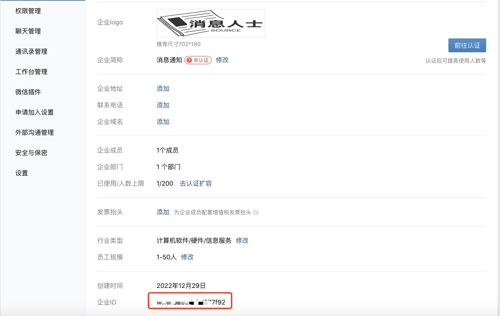

# CLOUDTOOL
云厂商提供的SDK，管理其云平台的工具🧰，比如创建实例，特别是像Oracle云亚州区域推出永久免费云服务器以来，资源特别紧张，依靠手动抢永久免费实例，现在几乎是不可能了，一直提示"Out of host capacity."容量足。
oci目录下`ociCompute.py`自动抢实例脚本工具，只要该区域有云计算实例资源释放，就会帮你顺利抢到永久免费的实例，并且推送消息到你的微信。

## 自动抢实例方法
要顺利运行该脚本工具，首先需要提前做好前置准备。
1. 推送消息的企业微信。
2. python3.10版本及以上
### 企业微信准备工作
当然首先得申请一个企业微信，申请是免费的，详细申请步骤百度或google，以下是申请好之后需要提供的企业微信信息。

- **企业ID**
登陆到企业微信后台, 找到 ***我的企业***，如下图：


- **企业Secret和agentid**
在 ***应用管理*** > 可以看到 *AgentId* 和 *Secret*


- **发送目标用户**
目标用户是就该企业用户名，如下图:


> 使用都只需要这4个企业微信信息即可，至于脚本程序执行逻辑可以查看源代码，或者使用不需要关心。

### 脚本程序使用
脚本程序在oci/ociCompute.py, 使用之前需要准备python包，os、sys、time、logging、json 为python3自身内置的包，不需要安装。
1. weChat.py 为推送消息编写的包，使用前只需要导入。
2. oci、requests 需要pip安装:
```python3
pip3 install oci requests
```
3. 导入环境变量`CLOUD_SRC`路径，为导入推送消息的微信包调置的环境变量, 路径为项目源码的根路径，例:
```bash
export CLOUD_SRC=/CloudTool
```
5. 准备用户验证的配置文件*#HOME/.oci/config*，关于配置文件结构需要参考Oracle云平台[文档](https://docs.oracle.com/en-us/iaas/tools/python/2.90.0/configuration.html)。
6. 准备创建实例*inst_configure.json*配置文件, 关于创建实例的配置文件可参考Oracle云平台[文档](https://docs.oracle.com/en-us/iaas/tools/python/2.90.0/configuration.html)